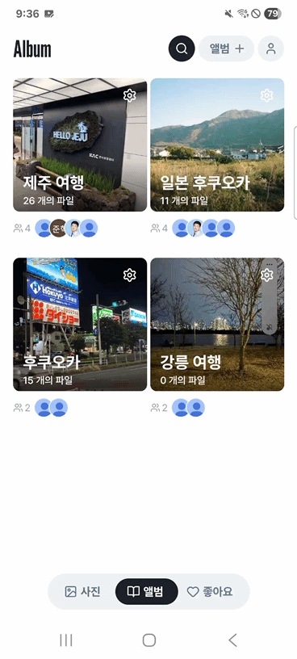
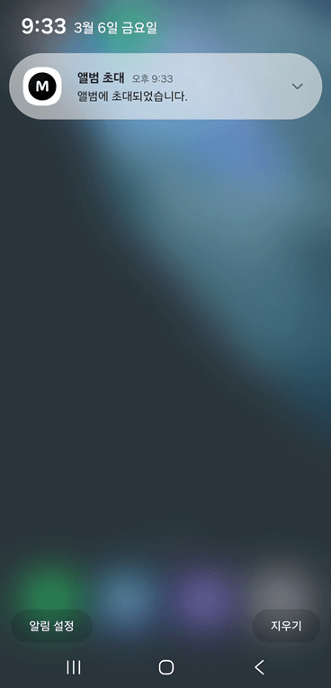

  <h1 style="display: flex; align-items: center; justify-content: center; width: 100%;">
    Momentry
  </h1>

 

## 📜 목차

1. [프로젝트 개요](#-프로젝트-개요)
2. [핵심 기능](#-핵심-기능)
3. [기술 스택](#%EF%B8%8F-기술-스택)
4. [아키텍처 구성](#-아키텍처-구성)
5. [팀원 소개](#-팀원-소개)
 

## 📝 프로젝트 개요

> **개발 기간** : `2026.1.8 ~ 2026.2.28(8주)`

더 이상 사진 공유를 위해 메신저를 뒤지거나 저장 공간을 낭비하지 마세요!
 
**Momentry**는 다운로드 없이 앨범 멤버들과 **실시간으로 사진을 공유**하고, 로컬 앨범처럼 **매끄러운 사용자 경험을 제공**하는 클라우드 기반 공유 앨범입니다.

## ⚡ 핵심 기능

### 1. 전체 사진 조회
- 전체 앨범 사진을 그리드 형태로 조회
- 사진 상세에서 메타데이터 기반 정보 확인 가능

| 사진 조회 | 사진 상세 |
| :---: | :---: |
| 

 | 

 |

### 2. 앨범 조회, 생성

- 내가 생성하거나 초대된 공유 앨범 목록 조회
- 앨범이름, 썸네일 설정 및 멤버 초대를 통해 새로운 공유 앨범 생성

| 앨범 조회 | 앨범 생성 | 멤버 초대 |
| :---: | :---: |:---:|
| 

 | 

 |

 |

### 3. 사진 업로드, 다운로드
- 사진을 업로드 기능 제공
- 원본 사진 다운로드 지원

| 사진 업로드 |
| :---: |
| 

 |

### 4. 태그 관리

- 앨범 단위 태그 추가, 수정, 삭제
- 개별 사진 단위 태그 관리 기능

| 태그 관리 | 사진 상세 태그 | 태그 지정 |
| :---: | :---: |:---:|
| 

 | 

 |

 |

### 5. 검색

- 검색어에 '#' 포함 시 태그 검색, 미포함시 앨범 검색
- 검색 결과 클릭 시 해당 앨범 또는 태그 화면으로 즉시 이동

| 태그 검색 | 앨범 검색 |
| :---: | :---: |
| 

 | 

 |

### 6. 알림

- 앨범 초대, 앨범 생성, 사진 업로드 이벤트 발생 시 실시간 알림 제공
  
| 알람 | 
| :---: |
| |

### 7. 권한 부여
- 앨범 내 3단계 권한 부여
- viewer : 조회만 가능, editor : 사진 및 태그 수정 가능, 관리자 : 멤버 관리 및 모든 권한 보유

| 권한 부여 | 
| :---: |
| 
|

## ⚙️ 기술 스택

### Frontend
- Language: TypeScript
- Framework: React Native, React
- 상태 관리: Zustand

### Backend
- Language: Java 21
- Framework: Spring, Spring Boot 4.0.1
- ORM: JPA
- 인증/보안: Spring Security
- Database: MySQL 8.0
- Messaging: AWS SQS

### Infra
- Cloud/Storage: AWS S3, AWS CloudFront
- Containerization: Docker, Docker Compose
- CI/CD: GitHub Actions
- Push 알림: Firebase Admin SDK 9.7.1 (FCM)

## 📐 아키텍처 구성

### 시스템 아키텍처

### ERD

## 👥 팀원 소개

| 김준혁   | 박상찬 | 홍정훈 | 박주희 | 구자원 | 오서로 | 이대연 |
| -------- | ------ | ------ | ------ | ------ | ------ | -------- |
| BE, 팀장 | BE     | BE     | BE     | BE     | FE     | FE |
